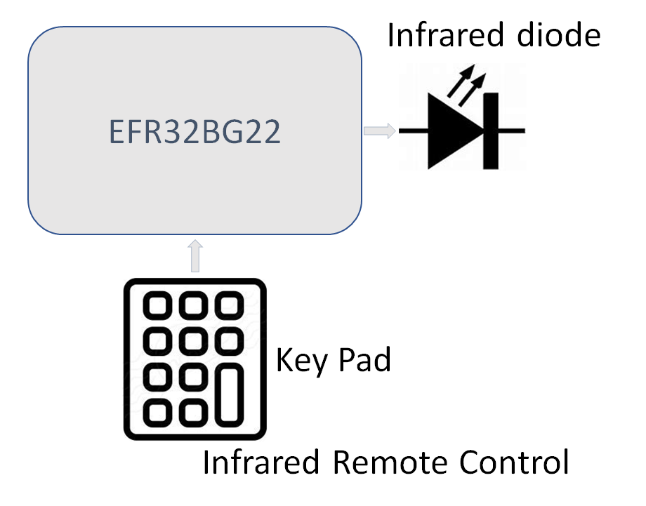
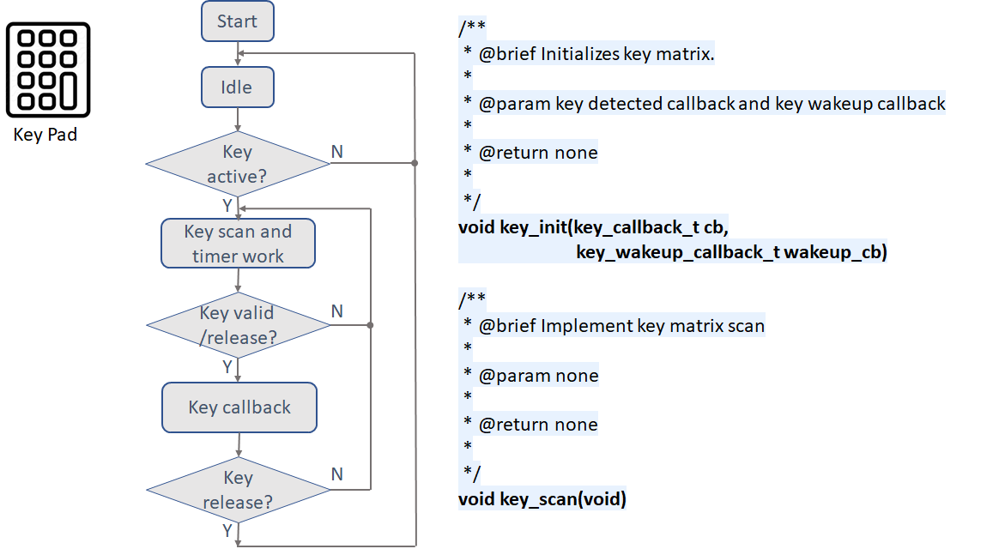
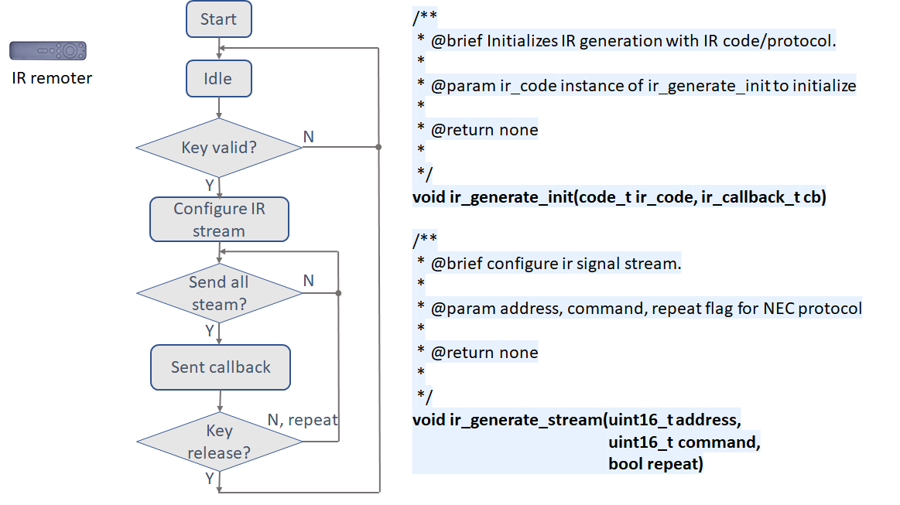

  

## Introduction
We have requirement from customer, that customer need reference design on IR signal generate on our EFR32 device(lynx). 
The expectation is ensure IR signal generate work well in case that BLE in a heavy communication. 
The project is base on BLE soc-empty, add a Notify test service for test IR signal generate work well during BLE communication. 

The files ir_generate.c and ir_generate.h are for IR generation functionality. 
API void ir_generate_init(code_t ir_code, ir_callback_t cb), use for init, mainly configure to send SONY/NEC IR protocol code, carrier frequency. 
The callback use for inditace the IR stream have sent completed. 
API void ir_generate_stream(uint16_t address, uint16_t command, bool repeat), use for send specific command. 

The files key_scan.c and key_scan.h are for key pad scan. Key pad support short/long/continue/key. To save power, Key timer will only work when key active. 
API void key_init(key_callback_t cb, key_wakeup_callback_t wakeup_cb), init key pad, register callback for key detected and key wakeup. If key valid it report by keydetected callback, If key wakeup, start key timer.

For test these both components, invoke the relearnt APIs in app.c.

## System block

  

## Keypad flowchart

  

## IR flowchart

  

